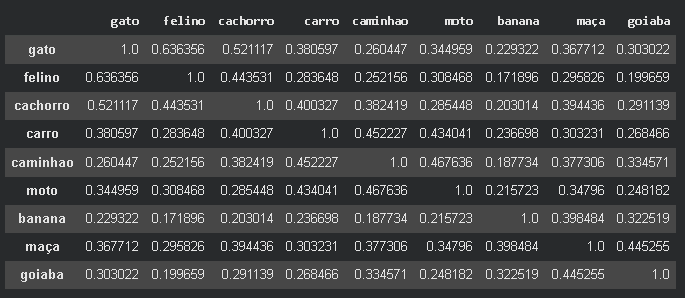
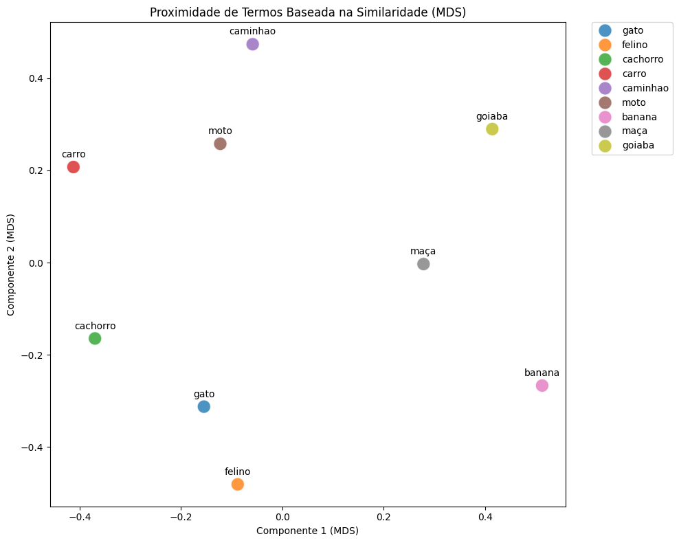
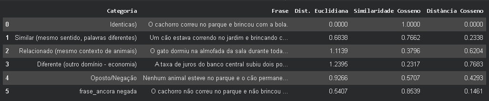
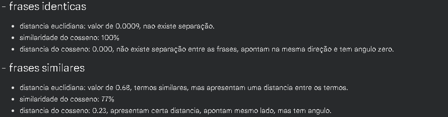
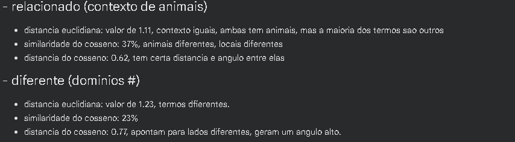
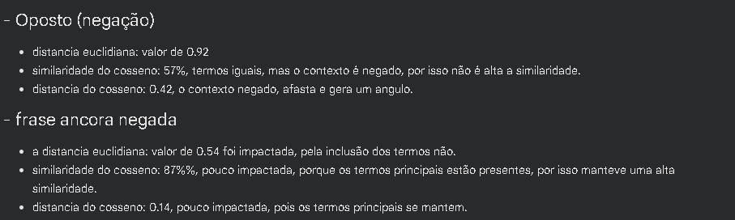

# Aluno: Silvio Cesar de Lima
# Aula 01 - Introdução a IA


Este projeto contém o código inicial para interagir com a API da OpenAI utilizando Python. 

Para garantir a eficiência de recursos e o isolamento das dependências, recomendamos fortemente o uso de um Ambiente Virtual Python (Virtual Environment ou `venv`).

## 🚀 Passo a Passo para Configuração e Execução

### 1. Criar o Ambiente Virtual (venv)
Abra o seu terminal na pasta raiz do projeto (`/IA`) e execute o seguinte comando para criar o ambiente virtual:

```bash
# No Linux/macOS
python3 -m venv venv

# No Windows
python -m venv venv
```

### 2. Ativar o Ambiente Virtual
Sempre que for trabalhar no projeto ou rodar os códigos, você precisa ativar o `venv`.

```bash
# No Linux/macOS
source venv/bin/activate

# No Windows
venv\Scripts\activate
```
*(Você saberá que o ambiente está ativado porque o nome `(venv)` aparecerá no início da linha de comando do terminal).*

### 3. Instalar as Dependências
Com o ambiente ativado, instale as bibliotecas necessárias (como `openai` e `python-dotenv`) a partir do arquivo `requirements.txt` que está na raiz do projeto:

```bash
pip install -r requirements.txt
```

### 4. Configurar as Variáveis de Ambiente (Segurança)
Para proteger seus dados e garantir a segurança, as chaves de API nunca devem ser inseridas diretamente no código nem comitadas em repositórios públicos.

Certifique-se de que o arquivo `.env` exista dentro da pasta `AULA_01` (ou na raiz, dependendo de onde for executar) com a seguinte estrutura:

```env
OPENAI_API_KEY=sua_chave_de_api_aqui
OPENAI_MODEL=gpt-4o-mini
```
*(Importante: adicione o arquivo `.env` ao seu `.gitignore` para não enviá-lo para o GitHub).*

### 5. Rodar o Código
Agora que o ambiente está isolado e as bibliotecas estão instaladas, você pode executar o script:

```bash
# Entre na pasta da aula
cd AULA_01

# Execute o script Python
python hello_llm.py
```

---
### 🛑 Como sair do Ambiente Virtual?
Quando terminar de programar, você pode desativar o ambiente virtual executando simplesmente:
```bash
deactivate
```

# Aula 02 - Converter pdf to md

Uso de Docling para extrair texto e exportar como Markdown

Extrair campos: titulo, autores e ano de edição


### Teste com guard-rail configurado no OPENROUTER para bloquear envio de endereço de mail para providers externos


# Aula 03 - Extrair Embedding e gerar Métricas

Gerar as funções e aplicar em termos e depois em frases.

Identificar as métricas geradas.

Conclusões.

##  Tabela de similaridade de termos



## Gráfico de similaridade de termos



## Tabela de similaridade de frases



## Conclusões / Observações





     
